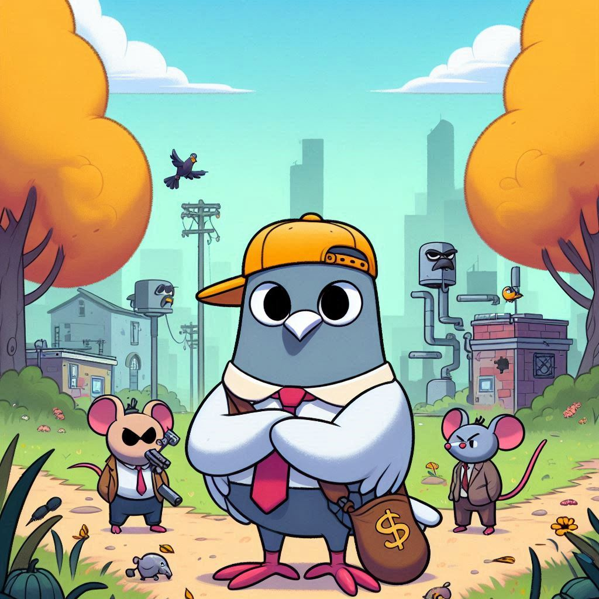

# 2RPlayers

Game Project  
Language: Java 21  
Framework: JavaFX  
Agile Framework: Scrum  

# Delivery Pigeon

    

# Presentation
Our team, consisting of analysts João Gabriel, João Pedro, Rafael Serio, and Luiz Gustavo, have developed a game inspired by the basic yet addictive mechanics of the classic Flappy Bird. We drew inspiration from the minimalist gameplay of this globally renowned game; however, our narrative and artistic style are entirely original. Under the title 'Delivery Pigeon', this project aims to showcase and enhance our skills in both back-end and front-end development, while applying the rapid methodology known as 'SCRUM'

# Prologue
In the game "Delivery Pigeon," players will dive into a captivating adventure that features 3 stages: countryside, city, and the sewage system. Controlling a carrier pigeon, they will navigate through these environments, challenged to avoid collisions with obstacles such as poles and pipes. With each stage completed, the player progresses to a new environment, but a collision with any obstacle signifies the end of the journey.

# Gameplay
"Delivery Pigeon" is a game where players will face the challenge of controlling a pigeon, attempting to keep it airborne with simple taps on specific keys, guiding it through spaces between obstacles while traversing different environments until the end of the Delivery Pigeon's journey.